# Product & Order Service (Spring Boot, JPA)

사전캠프 과제: 상품(Product) CRUD + 주문(Order) 생성/조회 + (도전) 주문 목록 조회/페이지네이션 + N+1 해결 + 재고 차감 + 원자성(락) 처리

---

## 1. 개발 환경

- Java: [예: 17 / 21 / 25]
- Spring Boot: [예: 3.x]
- DB: [MySQL / H2]
- ORM: Spring Data JPA (Hibernate)
- Tool: IntelliJ, Postman

---

## 2. 기능 구현 체크

### 필수 과제
- [x] 상품 등록
- [x] 상품 단건 조회
- [x] 상품 목록 조회
- [x] 상품 수정
- [x] 상품 삭제
- [x] 주문 생성 (상품 1개 선택)
- [x] 주문 단건 조회 (productName 포함 + 상품명 변경 반영)

### 도전 과제
- [x] 주문 목록 조회 (페이지네이션)
- [x] 주문 목록 조회 시 N+1 해결
- [x] 상품 재고(stock) 차감
- [x] 재고 원자성(Atomic) 확보

---

## 3. API 요약


Base URL: `/api`


### API 문서
- 전체 API 문서: [`api.md`](src/main/java/com/productorder/order/api.md)
- Product API 문서: [`api-product.md`](src/main/java/com/productorder/order/product/api-product.md)
- Order API 문서: [`api-order.md`](src/main/java/com/productorder/order/order/api-order.md)


### Product
- POST `/api/product` : 상품 등록
- GET `/api/product/{id}` : 상품 단건 조회
- GET `/api/product` : 상품 목록 조회
- PUT `/api/product/{id}` : 상품 수정
- DELETE `/api/product/{id}` : 상품 삭제

### Order
- POST `/api/order` : 주문 생성
- GET `/api/order/{id}` : 주문 단건 조회
- GET `/api/order` : 주문 목록 조회 (page/size)

---

## 4. 실행 방법

```bash
./mvnw spring-boot:run
```

## 5. Postman 실행 캡처

아래 이미지는 `docs/` 폴더에 저장된 Postman 실행 결과 캡처입니다.

### Product CRUD
- Create

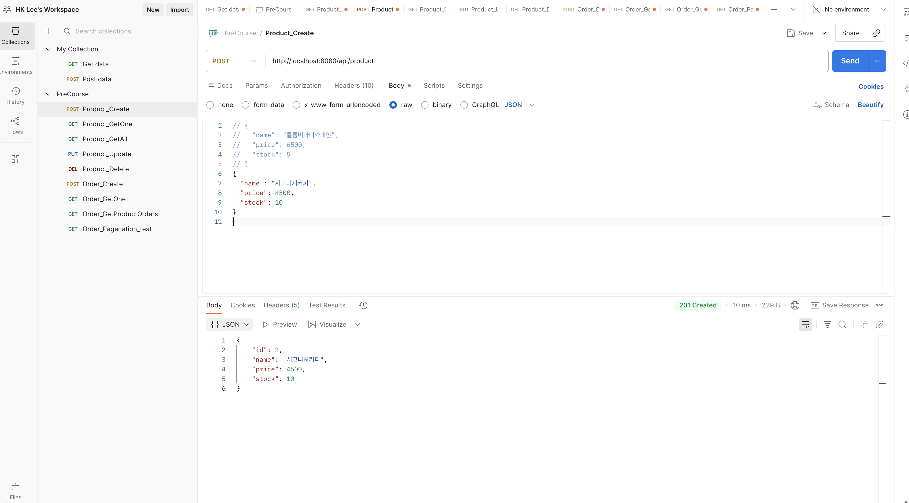

- Get One

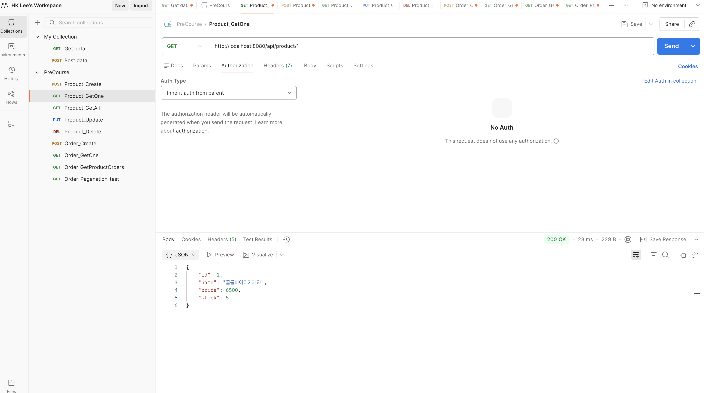

- Get All

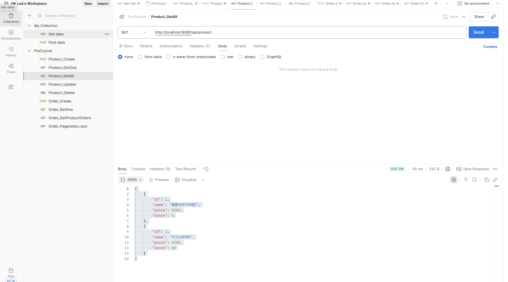

- Update

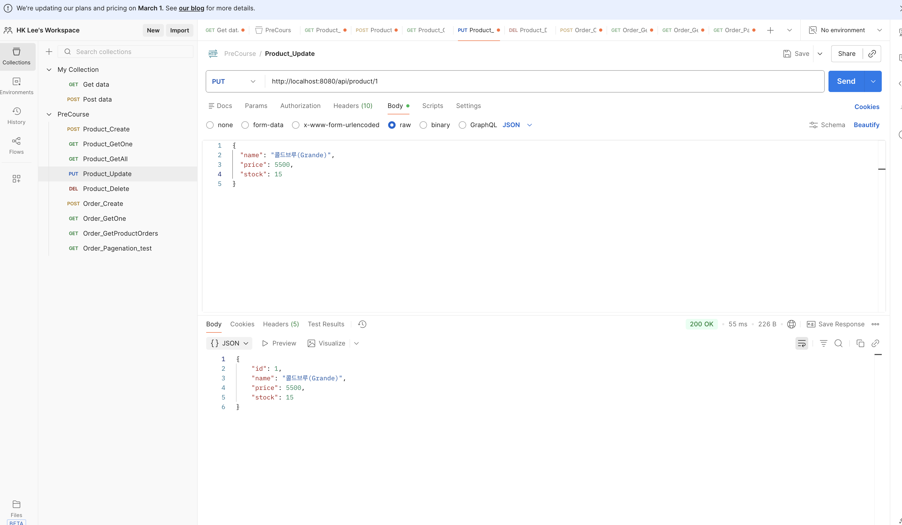

- Delete

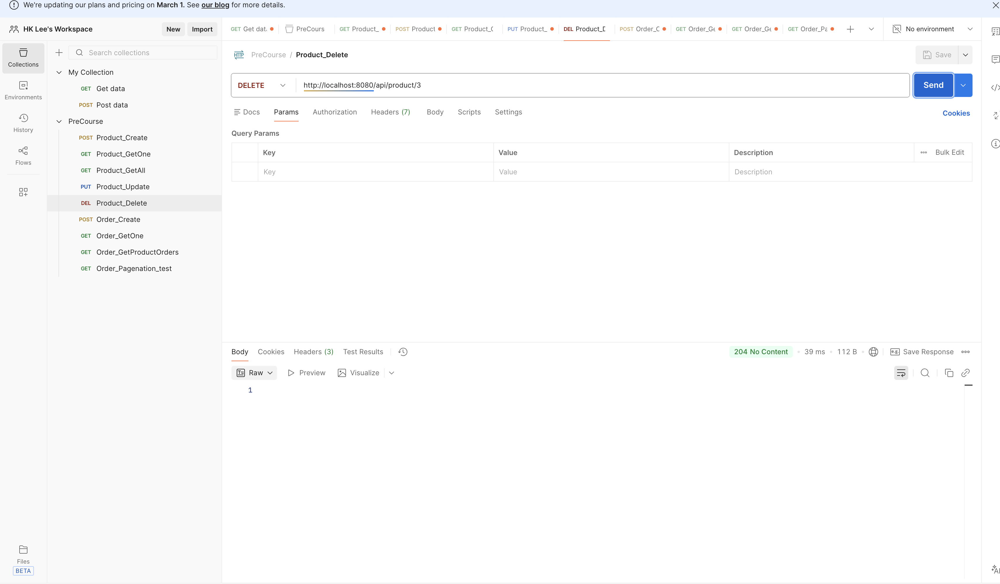

- Get All (After Delete)

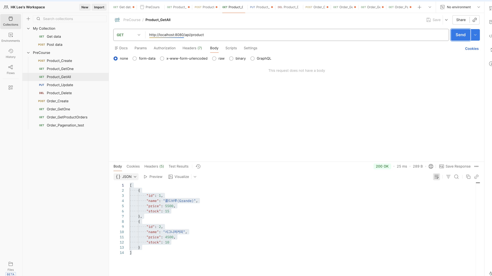

### Order
- Create (1)

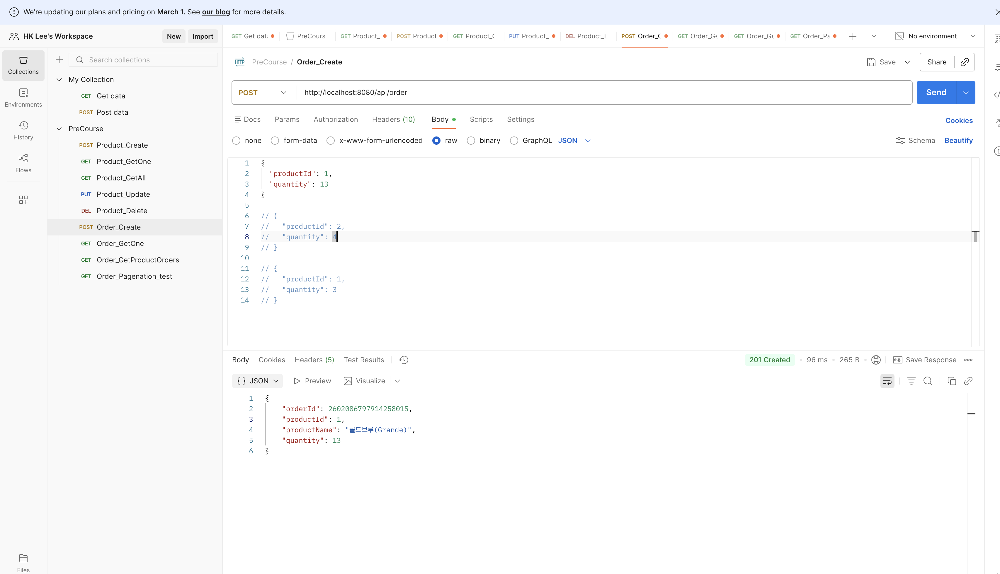

- Create (2)

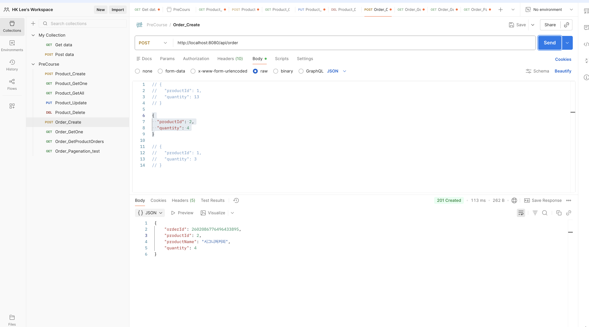

- Get One

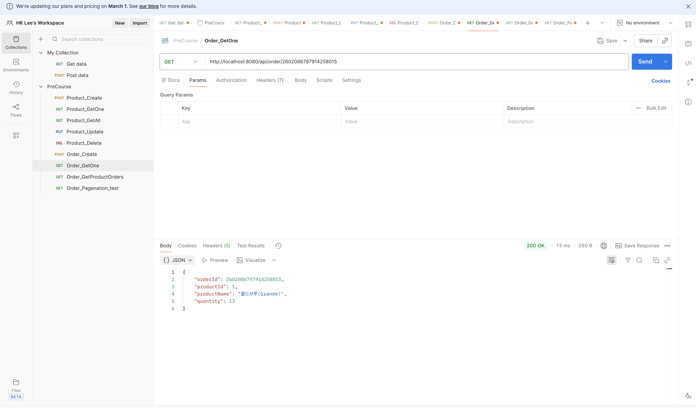

- Get Orders (Pagination)

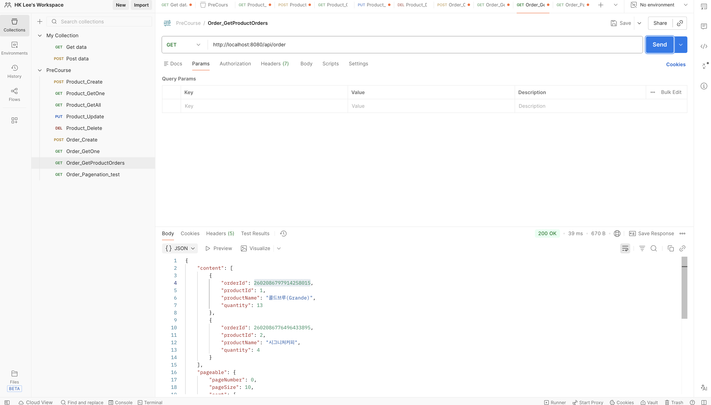

- Create Order For Page Test

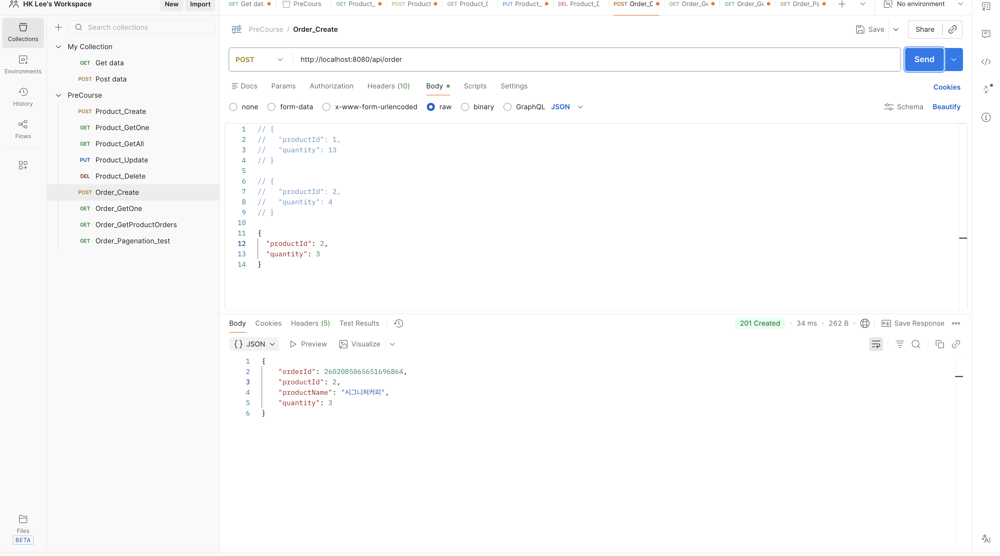

- Get Orders (page size = 2)

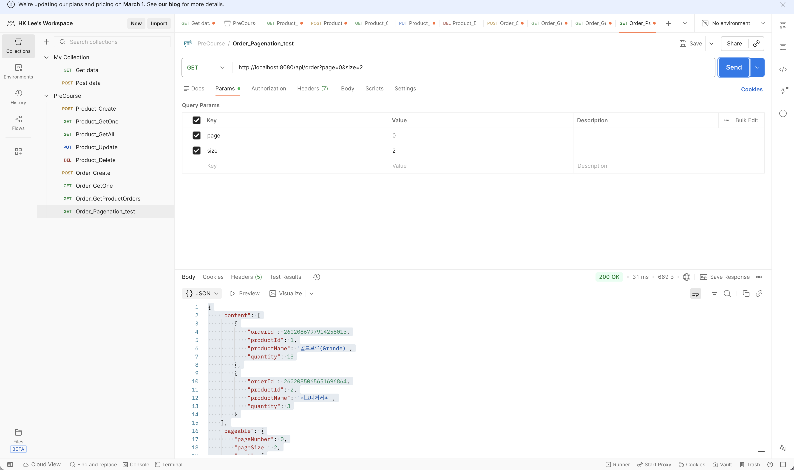

- Get Orders (default page size)

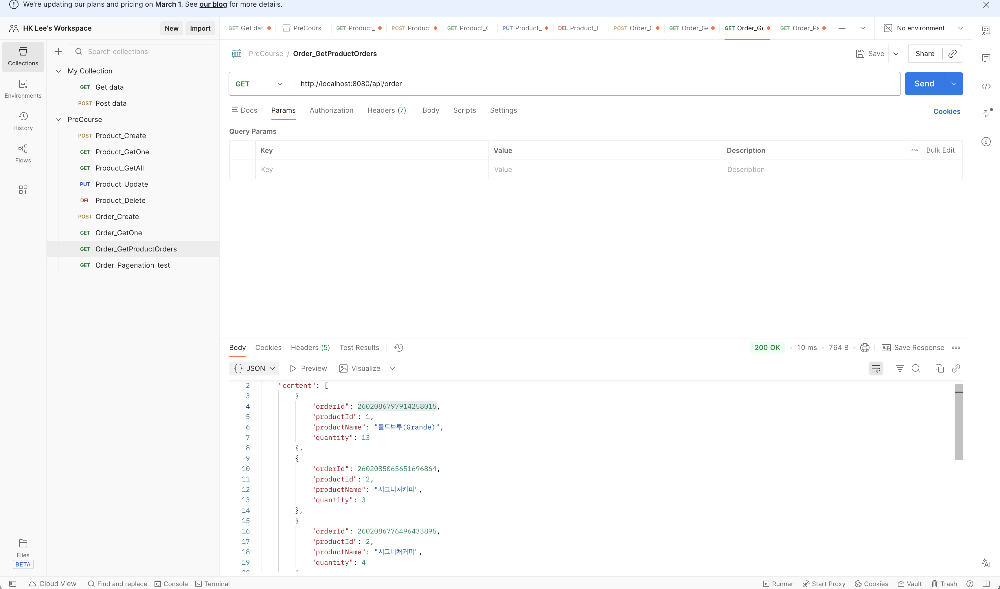

- Create Order (Out Of Stock)

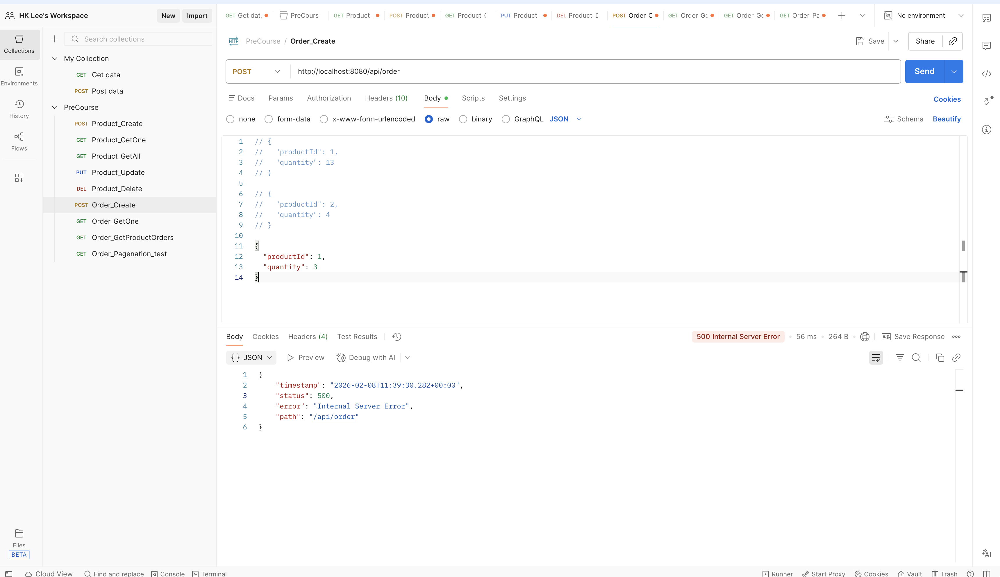

- stock=1 상품 생성

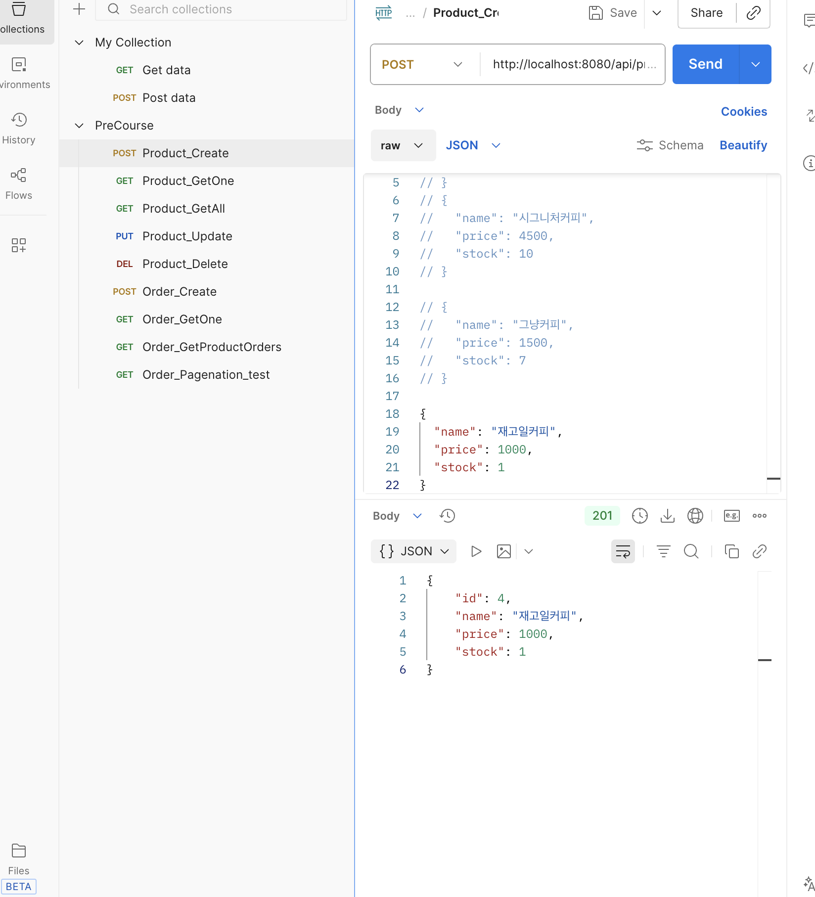

- 첫 번째 주문: 성공 (stock 1 → 0)

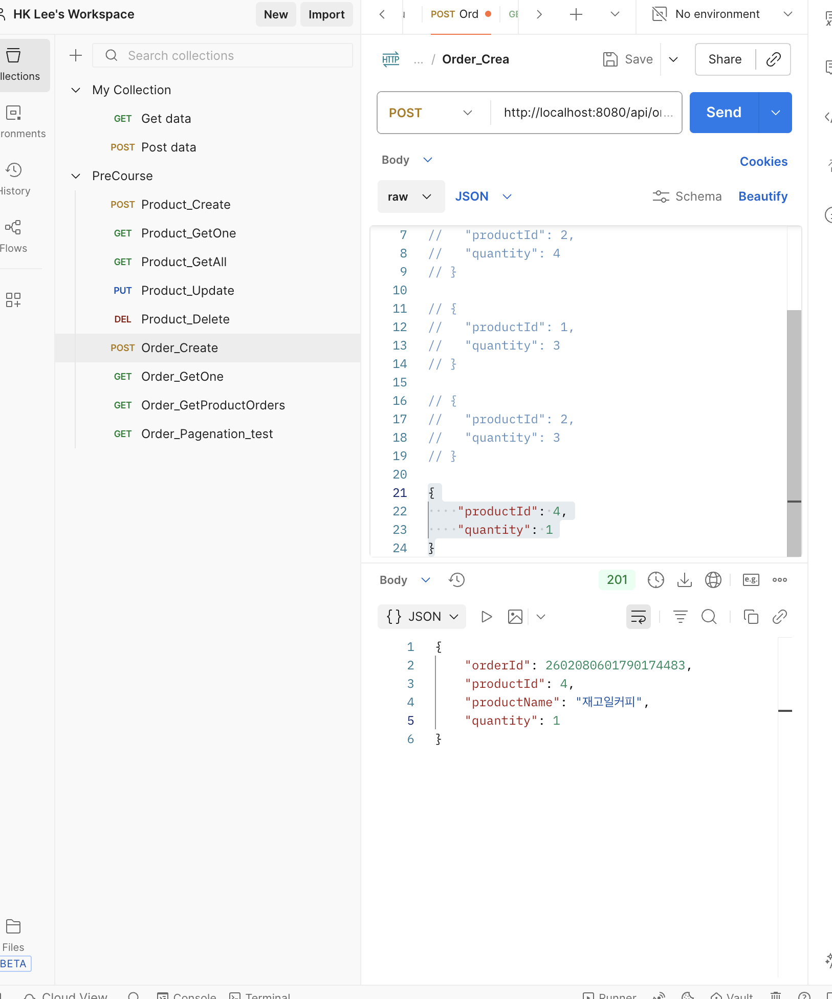

- 두 번째 주문: 실패 (재고 부족)

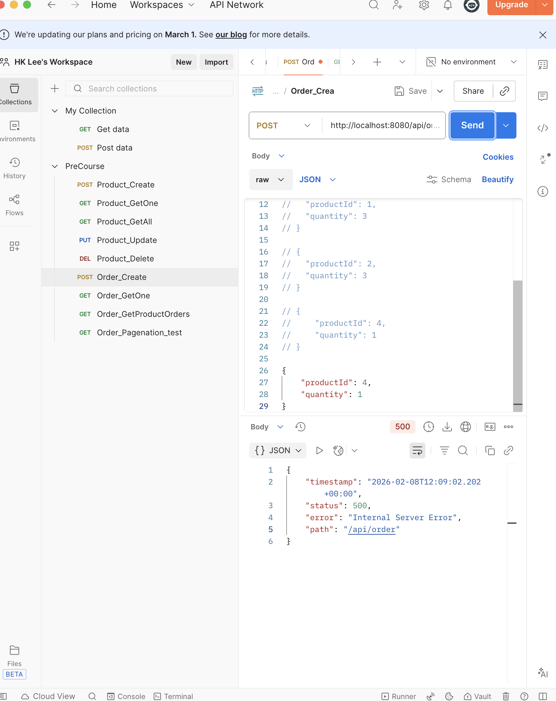
